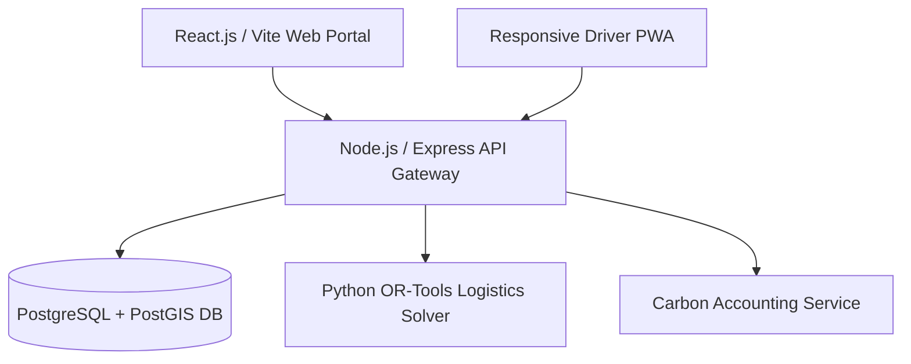

# LoopPack Exchange — HackOut'26 Ideation Report

> **Theme:** Circular Carbon Ecosystem  
> **Team Name:** Team one  
> **Team Members:** Jeel Aghera (Leader), Neev Katharotiya, Kashyap Saniyara, Tatsav Gangani  

---

## 1. Executive Summary
Industrial and commercial operations produce massive quantities of single-use packaging waste (corrugated cardboard boxes, wooden pallets, LDPE stretch wraps, HDPE drums). Simultaneously, nearby businesses purchase brand-new virgin packaging materials at high economic and environmental costs.

**Core Innovation:** **LoopPack Exchange** is an end-to-end B2B circular marketplace and eco-logistics platform designed to bridge the gap between waste generators (retailers, warehouses, manufacturing units) and material seekers (remanufacturers, packaging refurbishers, packaging recyclers, local SMEs).

By integrating **AI material grading**, **PostGIS spatial matchmaking**, **route-optimized eco-logistics**, and an **ISO/GHG Protocol aligned carbon accounting engine**, LoopPack transforms packaging waste from a costly disposal headache into a valuable secondary resource.

---

## 2. Problem Statement & Supply Chain Disconnect
Commercial packaging materials account for over 40% of solid commercial waste streams. Currently, waste generators and material buyers operate in two completely isolated, parallel supply chains:

- **As-Is Waste Generator Flow:** Material Generated ➔ Temporary Storage ➔ Internal Handling Overhead ➔ Waste Contractor / Local Scrap Dealer ➔ Landfill / Low-grade Recycling
- **As-Is Material Buyer Flow:** Packaging Need Arises ➔ Search & Contact Suppliers ➔ Purchase Virgin Material ➔ High Transport Costs ➔ High Embodied Carbon Footprint

**The LoopPack Opportunity:** LoopPack bridges these two disconnected workflows into a single real-time circular marketplace, turning waste disposal expenses into revenue while slashing virgin procurement costs and carbon emissions.

### Stakeholder Matrix & Value Proposition
| Stakeholder Persona | Industry Pain Points | LoopPack Value Proposition |
| :--- | :--- | :--- |
| **Retailers & Warehouses** | Cluttered space, high disposal fees, zero visibility into scrap value. | Instant listing of scrap packaging, monetization of waste, zero-cost clearance options. |
| **Manufacturers & SMEs** | High procurement costs for virgin boxes, pallets, and shrink wraps. | Purchase high-grade recycled/reused packaging at 30–60% lower costs. |
| **Packaging Recyclers** | Inconsistent raw material supply and mixed plastic/paper quality streams. | Access standardized, pre-graded bulk material lots filtered by location. |
| **Logistics Providers** | Empty backhaul return trips after retail deliveries. | Monetize empty return legs with eco-routed packaging pickups. |

---

## 3. Key System Modules
- **Module 1: AI-Assisted Material Listing & Standardization:** Converts vague, unstandardized industrial "waste" into a structured, tradable commodity. Computer vision helps categorize packaging type (Cardboard, Euro-Pallet, HDPE, LDPE) from photos, while quantity and quality grade (Grade A, B, C) are seller-entered and verified at pickup.
- **Module 2: B2B Geo-Proximity Marketplace:** Matches sellers with nearby buyers using PostGIS spatial indexing to minimize transport distances. Supports direct purchases, bidding, and free claim listings.
- **Module 3: Eco-Routed Logistics & Backhaul Optimization:** Groups multi-stop pickups into low-emission routes using Vehicle Routing Problem (VRP) algorithms.
- **Module 4: Real-Time Embodied Carbon & ESG Engine:** Calculates avoided embodied carbon emissions per transaction and generates downloadable Scope 3 ESG compliance certificates.

---

## 4. Technical Architecture & Tech Stack

| Component Layer | Technology Selected | Purpose & Justification |
| :--- | :--- | :--- |
| **Frontend UI** | React.js (Vite) + Tailwind CSS | Fast rendering, clean component structure, rich charts for carbon analytics dashboards. |
| **Backend API** | Node.js (Express) / TypeScript | Asynchronous RESTful APIs handling real-time requests and marketplace transactions. |
| **Database & Spatial Engine** | PostgreSQL + PostGIS Extension | Industry standard spatial queries to find listings within X kilometers of a buyer. |
| **Logistics Routing** | Python + Google OR-Tools / OSRM | Algorithmic routing solver minimizing travel distance and fuel consumption. |
| **Carbon Engine** | ISO 14044 LCA Data Parameters | Standardized mathematical service based on EPA WARM and Ecoinvent datasets. |

---

## 5. Carbon Calculation Framework
LoopPack embeds an explicit mathematical engine for embodied carbon accounting based on ISO 14044 Life Cycle Assessment (LCA) principles:

$$\text{Net CO}_2\text{e Avoided} = E_{\text{virgin}} - (E_{\text{reprocessing}} + E_{\text{transport}})$$

**Where:**
- **$E_{\text{virgin}}$:** Material Quantity (kg) × Virgin Emission Factor (e.g., 0.94 kg CO₂e/kg for Cardboard, 1.90 kg CO₂e/kg for HDPE, 28 kg CO₂e/pallet for Wooden Pallets).
- **$E_{\text{reprocessing}}$:** Processing overhead (0 for Grade A direct reuse, 0.12 kg CO₂e/kg for mechanical recycling).
- **$E_{\text{transport}}$:** Distance (km) × Weight (tons) × Freight Fuel Emission Factor (0.00016 kg CO₂e/ton-km).

---

## 6. Business Model & Financial Sustainability
1. **Marketplace Commission:** 2.5% to 5% platform fee on paid material trades.
2. **SaaS Subscription for Enterprise ESG Audit:** Premium tier for corporate enterprises requiring automated, audited Scope 3 ESG compliance report downloads.
3. **Logistics Convenience Fee:** Service fee for matching buyers with empty backhaul logistics fleets.

---

## 7. Implementation Roadmap
- **Phase 1 (Ideation - Current):** Architecture design, mathematical modeling, tech stack selection, Round 1 report submission.
- **Phase 2 (Hackathon MVP):** React (Vite) UI, Marketplace CRUD operations, PostGIS spatial search, Live Carbon Calculator widget.
- **Phase 3 (Final Polish):** Interactive route optimization map visualizer, AI material scanner demo, sample downloadable ESG PDF certificate.
